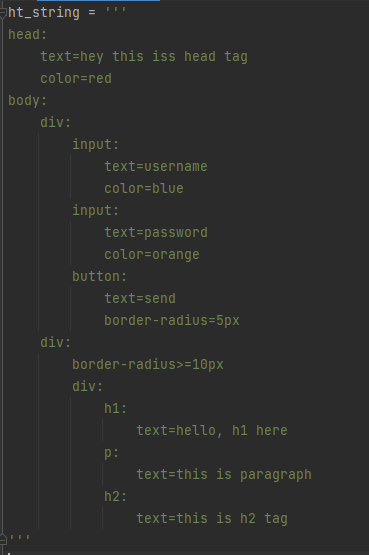
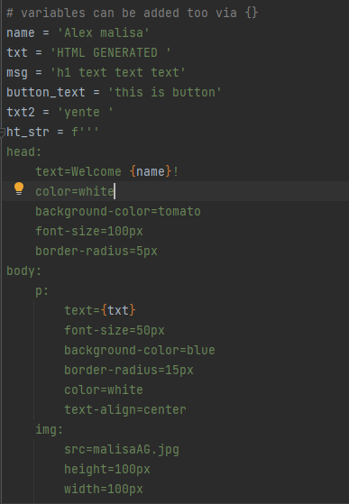
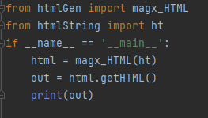

# htmlGenerator
a simple python program that convert a  3 quoted string into html codes, suppose you want to send an email(HTML formated email specifically) from your python script
then this piece shit is there for you, 
# how to format your string(triple quotes string)
in order to use this, the input string must be a multiline string(a triple quote string), the context is detemined by the intents
# tags
each tag ends with colon (:)
forexample head: ,body: ,p: ,img: ,div: ,input: ,button: ,h1: , h2: ,h3: ,h4: ,h5: etc
# attributes
equal sign (=) placed between attribute and its value
example
color=red
background-coloor=white
border-radius=10px
text-align=center

# Example
 
also, if you wanna include variables in your ht_string you can just use f string and add {variable_name} where you want it to be. 
eg 
 

# finally
 
you can write your string in the same python file or in separate file and then import it to your main py file 
**but it looks clean when you import it** :innocent:  

